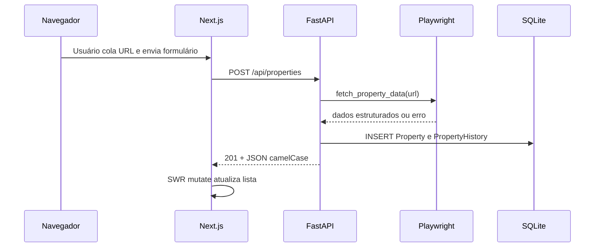
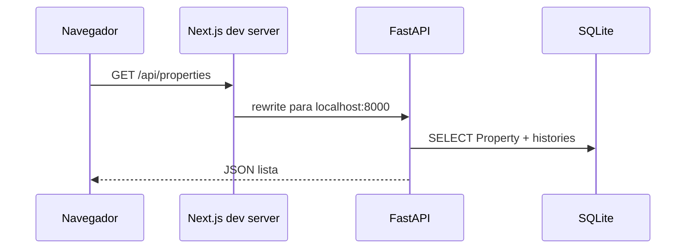
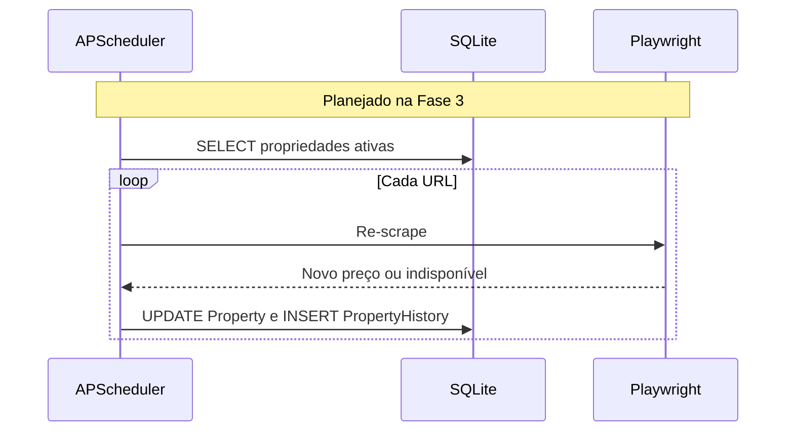

# Arquitetura e fluxo de dados

O **Monitora Imóveis** separa **frontend** (Next.js), **backend** (FastAPI) e **persistência** (SQLite). A atualização periódica em massa (**cron** interno) ainda não está implementada; o fluxo principal hoje é **cadastro sob demanda** + **leitura** da lista.

## Componentes

### 1. Frontend (Next.js — App Router)

- **Autenticação:** **Clerk** (`@clerk/nextjs`) — `ClerkProvider` no layout, `middleware.ts` protege rotas de página (exceto `/sign-in` e `/sign-up`); chamadas a `/api/*` passam pelo proxy para o FastAPI com header `Authorization: Bearer <JWT>` obtido via `useAuth().getToken()`.
- **Dashboard e formulário** são *Client Components* (`"use client"`): estado de busca/filtros, **SWR** para `GET /api/properties`, `useDeferredValue` / `useTransition` onde aplicável.
- **Proxy de desenvolvimento:** em `next.config.ts`, requisições a `/api/:path*` são reencaminhadas para `http://localhost:8000/api/:path*`, permitindo chamadas relativas `/api/properties` no browser.
- **Estilo:** Tailwind CSS e componentes no padrão shadcn/base.
- **Tipos:** `src/lib/types.ts` espelha o contrato JSON da API (camelCase).

### 2. Backend (FastAPI)

- **`main.py`:** aplicação FastAPI, CORS, `lifespan` que cria tabelas SQLite e dispõe o engine ao encerrar; `load_dotenv()` para `CLERK_ISSUER`.
- **`auth.py`:** validação do JWT do Clerk (JWKS em `/.well-known/jwks.json`, algoritmo RS256); dependência `get_current_user_id` em todas as rotas de imóveis.
- **`routers/properties.py`:** rotas REST sob prefixo `/api/properties`; dados filtrados por `user_id` (multi-tenant).
- **`scraper.py`:** `fetch_property_data(url)` assíncrono com Playwright; domínio *Primeira Porta* com extração por texto/regex; outros hosts com fallback genérico.
- **`schemas.py`:** modelos Pydantic de resposta com `alias_generator` camelCase; campo interno `property_type` serializado como **`type`** no JSON.

### 3. Persistência (SQLite + SQLModel)

- Arquivo típico: `backend/database.db` (criado na primeira subida da API).
- **`Property`:** URL única, dados do anúncio, `status` de saúde do scrape (`active` / `inactive` / etc., conforme modelo).
- **`PropertyHistory`:** histórico de preço por verificação; na prática MVP, entradas adicionais dependem da **Fase 3** (job periódico).

#### Normalização e dados derivados

O modelo segue um relacionamento **1:N** clássico (imóvel → várias linhas de histórico), adequado à **3NF** para a série temporal: não há grupos repetidos nem dependências parciais entre colunas da mesma linha de histórico.

A tabela **`Property`** mantém o **último estado conhecido** do anúncio (preço, status operacional, etc.), enquanto **`PropertyHistory`** guarda a **série** de verificações. Essa duplicação do “preço atual” em relação ao último ponto da série é uma **denormalização leve** voltada ao padrão de leitura do painel (OLTP: listagem e cartões sem agregar histórico em toda requisição). Faz sentido manter enquanto o domínio for single-user e o volume for modesto.

Para uma auditoria detalhada frente às boas práticas de schema (FK, índices, tipos monetários, migrações), ver **[database-evaluation.md](database-evaluation.md)**.

### 4. Jobs em background (planejado)

- **APScheduler** (dependência já no `requirements.txt`) ainda **não** está ligado ao `main.py`.
- Objetivo futuro: rodar o scraper em intervalos fixos, atualizar preços e status sem ação do usuário.

---

## Fluxo de dados

### A. Incluir imóvel (fluxo implementado)

### B. Listar imóveis (fluxo implementado)

### C. Atualização periódica (não implementado)

---

## Contrato da API (resumo)

| Método | Caminho | Descrição |
|--------|---------|-----------|
| `GET` | `/api/properties` | Lista imóveis com histórico agregado na resposta |
| `GET` | `/api/properties/{id}` | Detalhe de um imóvel |
| `POST` | `/api/properties` | Corpo `{"url": "https://..."}` — scrape + persistência |
| `DELETE` | `/api/properties/{id}` | Remove monitoramento |

Health check: `GET /` na raiz do FastAPI.

---

## Referências no repositório

| Pasta / arquivo | Papel |
|-------------------|--------|
| `backend/main.py` | App, CORS, lifespan |
| `backend/database.py` | Engine e sessão |
| `backend/models.py` | Entidades SQLModel |
| `backend/schemas.py` | Serialização da API |
| `backend/routers/properties.py` | Rotas REST |
| `backend/scraper.py` | Playwright |
| `frontend/src/lib/api.ts` | Chamadas HTTP |
| `frontend/next.config.ts` | Rewrite `/api` → backend |
| `docs/database-evaluation.md` | Aderência à skill database-schema-designer (checklist, backlog, go/no-go) |
