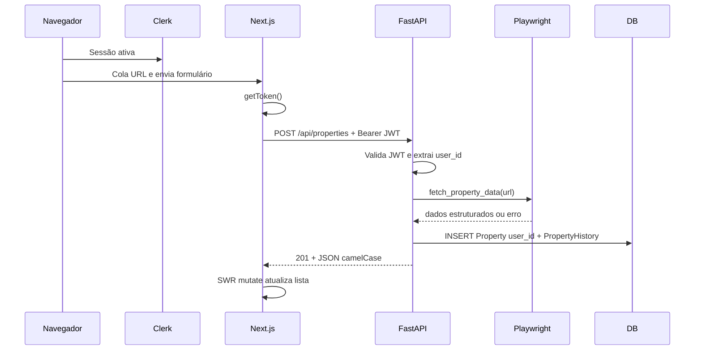
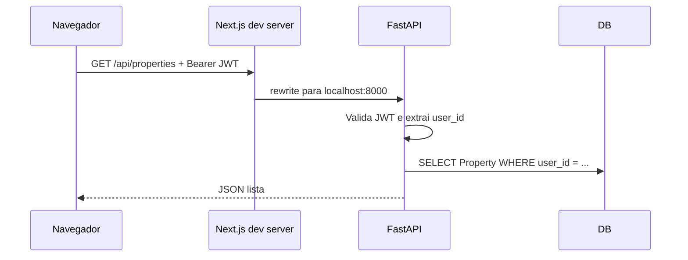
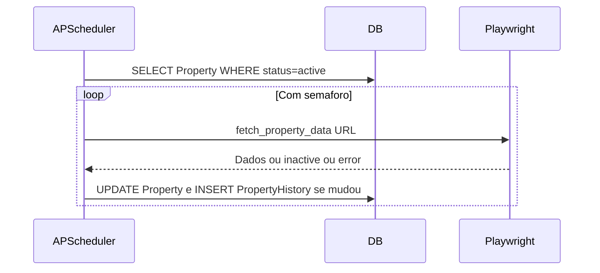
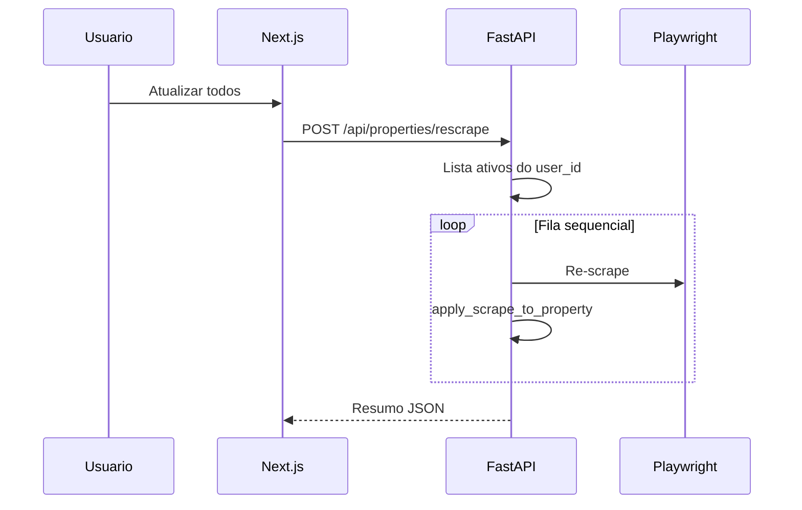
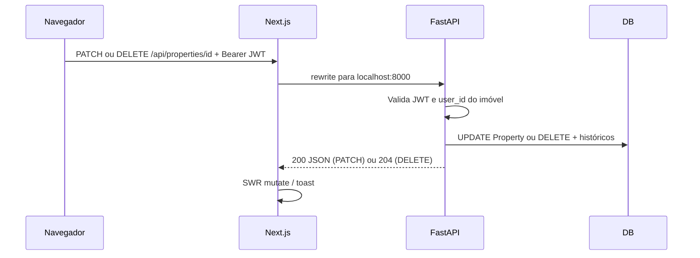

# Arquitetura e fluxo de dados

O **Monitora Imóveis** separa **frontend** (Next.js), **backend** (FastAPI) e **persistência** (**SQLite** em dev local ou **PostgreSQL** em produção, ex.: Neon, via `DATABASE_URL`). A autenticação é feita pelo **Clerk** no browser; o **FastAPI** valida o JWT e aplica **multi-tenant** por `user_id` em `Property`. O painel permite **listar, adicionar por URL, editar campos manuais, favoritar e excluir** (Fase 2d), **atualizar todos os imóveis ativos** via toolbar (**Fase 3**), além do **job agendado** no servidor que re-scrapeia anúncios `active` e evolui `PropertyHistory`.

## Componentes

### 1. Frontend (Next.js — App Router)

- **Autenticação:** **Clerk** (`@clerk/nextjs`) — `ClerkProvider` no layout, `src/proxy.ts` (convenção Next.js 16+) protege rotas de página (exceto `/sign-in` e `/sign-up`); o rewrite `/api/*` **não** passa por `auth.protect()` no proxy (a API valida o Bearer). Chamadas ao backend usam `Authorization: Bearer <JWT>` via `useAuth().getToken()` em `src/lib/api.ts`.
- **Dashboard e formulário** são *Client Components* (`"use client"`): estado de busca/filtros (inclui filtro **Favoritos** e busca por comentário), **SWR** para `GET /api/properties`, `useDeferredValue` / `useTransition` onde aplicável. **Toolbar** (`dashboard-toolbar.tsx`): **Atualizar todos** chama `POST /api/properties/rescrape` (fila no servidor) e atualiza a lista. **Sonner** para *toasts* após ações (edição, favorito, exclusão, batch de re-scrape).
- **CRUD no painel:** cada cartão oferece favoritar, abrir **edição** (`edit-property-dialog.tsx`: bairro, preço, comentário, status persistido) e **excluir** com confirmação; após sucesso chama-se `mutate()` do SWR.
- **Proxy de desenvolvimento:** em `next.config.ts`, requisições a `/api/:path*` são reencaminhadas para `http://localhost:8000/api/:path*`, permitindo chamadas relativas `/api/properties` no browser. Em **produção**, `NEXT_PUBLIC_API_URL` deve apontar para a API pública (ver [deploy.md](deploy.md)).
- **Estilo:** Tailwind CSS e componentes no padrão shadcn/base.
- **Tipos:** `src/lib/types.ts` espelha o contrato JSON da API (camelCase).

### 2. Backend (FastAPI)

- **`main.py`:** aplicação FastAPI, **CORS** (`CORS_ORIGINS` em produção; localhost se vazio), `lifespan` que aplica schema: com **`DATABASE_URL`** corre **Alembic** `upgrade head`; sem URL usa **SQLite** (`create_all` + migração idempotente em [migrations_sqlite.py](../backend/migrations_sqlite.py)); inicia o **APScheduler** ([`scheduler.py`](../backend/scheduler.py)) e dispõe o engine ao encerrar; `load_dotenv()`. URLs Postgres do tipo `postgresql://` são normalizadas para **psycopg 3** em [`db_url.py`](../backend/db_url.py).
- **`auth.py`:** validação do JWT do Clerk (JWKS em `{CLERK_ISSUER}/.well-known/jwks.json`, algoritmo RS256); dependência `get_current_user_id` nas rotas de imóveis e em `/api/jobs`.
- **`routers/properties.py`:** rotas REST sob prefixo `/api/properties`; dados filtrados por `user_id` (multi-tenant); `PATCH` para atualização parcial (campos manuais); `POST /rescrape` para batch manual por usuário.
- **`routers/jobs.py`:** `GET /api/jobs/status` — métricas do último ciclo agendado e próxima execução (quando o scheduler está ativo).
- **`jobs.py`:** `apply_scrape_to_property`, `rescrape_properties_for_user`, `rescrape_all_active_global` (job global); logging `monitora.jobs`.
- **`scraper.py`:** `fetch_property_data(url)` assíncrono com Playwright; **Primeira Porta** (`primeiraporta.com.br`) com extração por texto/regex; **i9vale** (`i9vale.com.br`, plataforma Kenlo) com rotina dedicada (rótulos colados ao número, linha “Localização”, slug `...-N-quartos-M-m...` na URL); demais hosts com fallback genérico e os mesmos padrões de URL quando aplicável.
- **`schemas.py`:** modelos Pydantic de resposta com `alias_generator` camelCase; campo interno `property_type` serializado como **`type`** no JSON; **`listingStatus`** expõe o status persistido no banco; **`status`** continua **derivado** para o painel (ativo, indisponível, preço subiu/caiu).

### 3. Persistência (SQLModel)

- **Desenvolvimento local (sem `DATABASE_URL`):** ficheiro `backend/database.db` + `PRAGMA foreign_keys=ON` (ver [`database.py`](../backend/database.py)).
- **Produção:** **PostgreSQL** (ex.: Neon); conexão via `DATABASE_URL`; migrações **Alembic** em [`backend/alembic/`](../backend/alembic/). Valores monetários: `Numeric`/`Decimal` no modelo; JSON da API continua em float para o frontend.
- **`Property`:** `user_id` (string Clerk), URL **única por usuário** (constraint composta `user_id` + `url`), demais dados do anúncio, `comment` e `favorite` (edição manual), `status` de saúde do scrape/listagem (`active` / `inactive` / `error`, conforme modelo).
- **`PropertyHistory`:** histórico de preço por verificação; novas linhas são gravadas pelo **job agendado** e pelo **`POST /api/properties/rescrape`** quando há mudança de preço, indisponibilidade ou reativação.

#### Normalização e dados derivados

O modelo segue um relacionamento **1:N** clássico (imóvel → várias linhas de histórico), adequado à **3NF** para a série temporal: não há grupos repetidos nem dependências parciais entre colunas da mesma linha de histórico.

A tabela **`Property`** mantém o **último estado conhecido** do anúncio (preço, status operacional, etc.), enquanto **`PropertyHistory`** guarda a **série** de verificações. Essa duplicação do “preço atual” em relação ao último ponto da série é uma **denormalização leve** voltada ao padrão de leitura do painel (OLTP: listagem e cartões sem agregar histórico em toda requisição). Faz sentido enquanto o volume por usuário for modesto.

Para uma auditoria detalhada frente às boas práticas de schema (FK, índices, tipos monetários, migrações), ver **[database-evaluation.md](database-evaluation.md)**.

### 4. Jobs em background (implementado)

- **APScheduler** `AsyncIOScheduler` em [`scheduler.py`](../backend/scheduler.py): job `rescrape_all_active_global` em intervalo `RESCRAPE_INTERVAL_HOURS` (default 12); `DISABLE_SCHEDULER=1` desliga o agendador (ex.: testes).
- Processamento **global** de todos os `Property` com `status = active` (todos os usuários), com **semáforo** `RESCRAPE_MAX_CONCURRENT` para limitar instâncias Playwright simultâneas.
- **Manual:** `POST /api/properties/rescrape` processa em **fila** apenas os imóveis **ativos** do usuário autenticado.

---

## Fluxo de dados

### A. Incluir imóvel (fluxo implementado)

### B. Listar imóveis (fluxo implementado)

### C. Atualização periódica e batch manual (implementado)

### D. Editar ou excluir imóvel (fluxo implementado)

---

## Contrato da API (resumo)

Todas as rotas abaixo exigem cabeçalho **`Authorization: Bearer <JWT>`** (sessão Clerk). Respostas **401** se o token estiver ausente ou inválido. Detalhe/get/delete de outro usuário → **404**.

| Método | Caminho | Descrição |
|--------|---------|-----------|
| `GET` | `/api/properties` | Lista imóveis do usuário com histórico agregado na resposta |
| `GET` | `/api/properties/{id}` | Detalhe de um imóvel (se pertencer ao usuário) |
| `POST` | `/api/properties` | Corpo `{"url": "https://..."}` — scrape + persistência com `user_id` |
| `PATCH` | `/api/properties/{id}` | Atualização parcial (camelCase): `neighborhood`, `price`, `comment`, `favorite`, `status` (`active` \| `inactive` \| `error`). Alterar `price` aqui **não** insere linha em `PropertyHistory`. |
| `POST` | `/api/properties/rescrape` | Re-scrape em fila de **todos** os imóveis `active` do usuário; resposta com resumo e `results` por id. |
| `DELETE` | `/api/properties/{id}` | Remove monitoramento (se pertencer ao usuário) |
| `GET` | `/api/jobs/status` | Métricas do último ciclo do job agendado, intervalo e próxima execução (se o scheduler estiver ativo). |

Health check: `GET /` na raiz do FastAPI.

---

## Referências no repositório

| Pasta / arquivo | Papel |
|-----------------|--------|
| `backend/main.py` | App, CORS, lifespan, Alembic ou SQLite + `migrations_sqlite`, scheduler no startup |
| `backend/db_url.py` | Normalização `DATABASE_URL` → driver psycopg 3 |
| `backend/alembic/` | Migrações PostgreSQL |
| `backend/Dockerfile` | Imagem de produção (uvicorn + Playwright Chromium) |
| `backend/scheduler.py` | APScheduler, intervalo de re-scrape global |
| `backend/jobs.py` | Lógica de re-scrape, métricas em memória |
| `backend/routers/jobs.py` | `GET /api/jobs/status` |
| `backend/migrations_sqlite.py` | Colunas novas em DBs antigos (`ALTER` idempotente) |
| `backend/auth.py` | Validação JWT Clerk |
| `backend/database.py` | Engine e sessão |
| `backend/models.py` | Entidades SQLModel |
| `backend/schemas.py` | Serialização da API |
| `backend/routers/properties.py` | Rotas REST |
| `backend/scraper.py` | Playwright |
| `frontend/src/proxy.ts` | Clerk: proteção de rotas de página (Next.js 16+: `proxy` em vez de `middleware`) |
| `frontend/src/app/sign-in/[[...sign-in]]/page.tsx` | UI de login |
| `frontend/src/app/sign-up/[[...sign-up]]/page.tsx` | UI de cadastro |
| `frontend/src/lib/api.ts` | Chamadas HTTP com Bearer (`fetchProperties`, `addProperty`, `rescrapeAll`, `fetchJobStatus`, `updateProperty`, `deleteProperty`) |
| `frontend/src/components/dashboard-toolbar.tsx` | Toolbar: Atualizar todos, tema, usuário, adicionar imóvel |
| `frontend/src/components/edit-property-dialog.tsx` | Formulário de edição manual |
| `frontend/next.config.ts` | Rewrite `/api` → backend |
| `docs/database-evaluation.md` | Aderência à skill database-schema-designer (checklist, backlog, go/no-go) |
