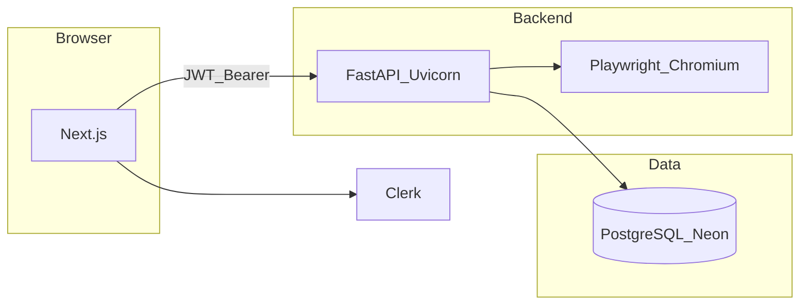

# Deploy (produção)

Guia operacional para hospedar o **Monitora Imóveis** com **Next.js** (ex.: Vercel), **FastAPI** (contentor ou PaaS com processo longo), **PostgreSQL** (ex.: Neon) e **Clerk**. O CI do repositório (`.github/workflows/ci.yml`) valida testes, lint, build e imagem Docker em cada push/PR.

---

## Arquitetura alvo



- O **browser** fala com o **frontend** (HTTPS) e obtém o JWT via **Clerk**.
- As chamadas à API usam `Authorization: Bearer` para o **FastAPI** (URL pública separada do Next).
- O **scheduler** (APScheduler) e o **Playwright** exigem um processo **sempre ligado** (não use apenas funções serverless sem suporte a tarefas longas/cron interno, a menos que mova o job para outro serviço).

---

## Ordem de provisionamento sugerida

1. **Neon:** criar projeto, copiar `DATABASE_URL` (aceita `postgresql://`; o backend normaliza para `postgresql+psycopg://` — ver [`db_url.py`](../backend/db_url.py)).
2. **Schema:** `alembic upgrade head` (ou primeira subida da API com `DATABASE_URL` definido — o `lifespan` aplica migrações).
3. **Dados (opcional):** [`backend/scripts/migrate_data.py`](../backend/scripts/migrate_data.py) se vier de SQLite local.
4. **Backend:** expor HTTPS (reverse proxy ou PaaS), definir variáveis (tabela abaixo), incluindo **`CORS_ORIGINS`** com a origem exata do frontend.
5. **Clerk (produção):** instância ou ambiente de produção; **Frontend API URL** = `CLERK_ISSUER`; URLs autorizadas do app (sign-in, domínio Vercel).
6. **Frontend (Vercel):** `NEXT_PUBLIC_API_URL` = URL base da API **sem** barra final (ex.: `https://api.seudominio.com`).
7. Smoke: login, listar imóveis, adicionar URL de teste.

---

## Matriz de variáveis de ambiente

| Variável | Onde | Descrição |
|----------|------|-----------|
| `DATABASE_URL` | Backend | Postgres (Neon). Obrigatório em produção. `?sslmode=require` recomendado. |
| `CLERK_ISSUER` | Backend | **Frontend API URL** do Clerk (claim `iss` do JWT). |
| `CORS_ORIGINS` | Backend | Lista separada por vírgulas das origens HTTPS do frontend (ex.: `https://app.vercel.app`). Se vazio, usa só localhost (dev). |
| `RESCRAPE_INTERVAL_HOURS` | Backend | Intervalo do job global (default 12). |
| `RESCRAPE_MAX_CONCURRENT` | Backend | Concorrência Playwright no job global (default 2). |
| `DISABLE_SCHEDULER` | Backend | `1` para desligar APScheduler (raro em produção). |
| `NEXT_PUBLIC_CLERK_PUBLISHABLE_KEY` | Frontend | Chave pública Clerk. |
| `CLERK_SECRET_KEY` | Frontend | Segredo Clerk (servidor Next). |
| `NEXT_PUBLIC_API_URL` | Frontend | **Base URL da API** em produção (ex.: `https://api...`). Sem `/` no fim. Em dev local pode ficar vazio (usa paths relativos + rewrite no Next). |

Variáveis opcionais: `PLAYWRIGHT_BROWSERS_PATH` (ex.: Windows / paths custom); ver [README](../README.md).

---

## Backend (FastAPI)

- **Comando:** `uvicorn main:app --host 0.0.0.0 --port 8000` (o [`Dockerfile`](../backend/Dockerfile) usa o mesmo).
- **Health:** `GET /` — mensagem simples de serviço ativo.
- **Imagem Docker:** na pasta `backend`:

  ```bash
  docker build -f Dockerfile -t monitora-api:latest .
  docker run --env-file .env -p 8000:8000 monitora-api:latest
  ```

  Exige `.env` com `DATABASE_URL`, `CLERK_ISSUER`, `CORS_ORIGINS`, etc. A imagem instala **Chromium** via Playwright (`playwright install --with-deps chromium`).

- **CORS:** sem `CORS_ORIGINS`, o browser em produção **não** conseguirá chamar a API a partir do domínio do Vercel; configure as origens reais.

---

## Frontend (Next.js)

- Em **produção**, `NEXT_PUBLIC_API_URL` deve apontar para a API pública. O código em [`frontend/src/lib/api.ts`](../frontend/src/lib/api.ts) faz `fetch(\`${API_BASE}/api/properties\`)`; com base vazia, o browser pede `/api/...` **ao mesmo host** do Next — no Vercel **não** existe proxy para o FastAPI, por isso a base tem de ser a URL do backend.
- O **rewrite** em [`frontend/next.config.ts`](../frontend/next.config.ts) (`/api/*` → `localhost:8000`) serve **apenas desenvolvimento local**.

---

## Clerk

- O **`CLERK_ISSUER`** no backend deve coincidir com a **Frontend API URL** mostrada no dashboard (JWT `iss`).
- Configure **Authorized redirect URLs** e o domínio de produção do frontend (e previews Vercel, se necessário).

---

## CI/CD

O workflow [`.github/workflows/ci.yml`](../.github/workflows/ci.yml) executa:

- **backend:** `pytest` com `TESTING=1`, `DISABLE_SCHEDULER=1`, `CLERK_ISSUER` de exemplo.
- **frontend:** `npm ci`, `npm run lint`, `npm run build` (variáveis Clerk de placeholder no workflow).
- **docker-backend:** `docker build` do `backend/Dockerfile` para validar a imagem.

Push para registry (GHCR, ECR) e deploy automático podem ser acrescentados depois, reutilizando a mesma imagem.

---

## Checklist pré go-live

- [ ] Migrações aplicadas (`alembic_version` / tabelas criadas no Neon).
- [ ] `CORS_ORIGINS` inclui o domínio exato do frontend (esquema + host, sem path).
- [ ] `NEXT_PUBLIC_API_URL` no Vercel aponta para a API.
- [ ] Clerk com URLs de produção e mesmo `iss` que `CLERK_ISSUER`.
- [ ] Teste manual: login, `GET /api/properties` com token, adicionar imóvel de teste.

---

## Referências

| Documento | Conteúdo |
|-----------|----------|
| [backend/README.md](../backend/README.md) | Setup local, SQLite vs Postgres, Alembic |
| [docs/arquitetura.md](arquitetura.md) | Fluxos e componentes |
| [docs/roadmap.md](roadmap.md) | Fase 5 e backlog |
